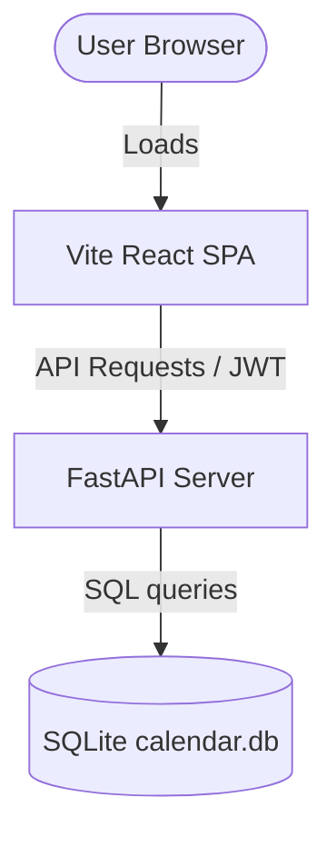

# Google Calendar Clone (gcal-clone)

A full-stack, pixel-perfect Google Calendar clone. This application supports user authentication, responsive day/week/month views, event dragging, event resizing, recurrence rules parsing, and scheduling overlap conflict detections.

---

## Tech Stack & Architecture Decisions

### Backend
- **Framework**: **FastAPI**
  - *Why*: Provides high performance, automatic OpenAPI (Swagger) documentation, and native asynchronous support, making it perfect for rapid calendar scheduling operations.
- **ORM**: **SQLAlchemy 2.0**
  - *Why*: Modernized Python database engine offering robust transaction management, query relationships mapping, and clean data modeling syntax.
- **Database**: **SQLite**
  - *Why*: Lightweight, single-file database that simplifies local configuration and runs cross-platform without external database daemon dependencies.
- **Authentication**: **JWT (JSON Web Tokens)** + **Passlib (Bcrypt)**
  - *Why*: Secure, stateless user sessions matching modern SPA standards, with reliable password hashing.

### Frontend
- **Framework**: **React 18** (via **Vite**)
  - *Why*: Vite provides near-instantaneous hot module reloading (HMR) and ultra-fast builds. React offers component reusability and clean state bindings.
- **Styling**: **Tailwind CSS**
  - *Why*: Low-level utility classes that allow us to replicate the official Google Calendar theme, fonts, borders, and margins with maximum fidelity.
- **State Management**: **Zustand**
  - *Why*: Simple, boilerplate-free state store that provides clean getter/setter actions, avoiding the overhead of heavy Redux setups.
- **Date Utilities**: **date-fns** & **rrule**
  - *Why*: `date-fns` provides lightweight, immutable helper functions for calendars. The `rrule` library translates RFC-compliant recurrence strings into individual event occurrences on the frontend.
- **Drag-and-Drop**: **@dnd-kit**
  - *Why*: Modular, accessibility-friendly drag-and-drop library for React that supports pointer offsets and custom constraints.

---

## How the Project Works

The application operates as a decoupled single-page application (SPA) communicating with a JSON REST API:



### 1. The Database Layout
- **Users**: Holds registration emails and hashed passwords.
- **Events**: Represents event entries. Key fields include:
  - `start_time` & `end_time` (stored as naive UTC datetimes).
  - `rrule` string (e.g. `FREQ=WEEKLY` for repeating occurrences).
  - `recurrence_id` (foreign key to self, marking exception overrides if a user edits a specific occurrence of a recurring series).

### 2. Timezone Normalization
To prevent scheduling offsets across clients:
- The backend accepts and normalizes all incoming datetimes to naive UTC.
- The frontend converts UTC ISO strings received from the API into local JS `Date` objects, aligning event displays automatically with the browser's local timezone.

### 3. Overlap Conflict Detection
- When creating or modifying an event (excluding all-day and recurring parent events), the backend calculates overlapping intervals using:
  `A_start < B_end AND A_end > B_start`
- If an overlap exists, the API rejects the request with a `409 Conflict` containing the conflicting events list.
- The frontend interceptor triggers a custom toast banner presenting the scheduling conflict. The user can either cancel the save or proceed to "Save anyway" (which appends `?force=true` to bypass the check).

### 4. Drag-and-Drop and Resize Logic
- Time grid events are positioned using percentage height coordinates:
  - `Top% = (Minutes from Midnight / 1440) * 100`
  - `Height% = (Duration in Minutes / 1440) * 100`
- Moving blocks uses `dnd-kit` coordinates to compute vertical delta pixels, which are mapped to 15-minute time intervals.
- The frontend updates the display optimistically for zero lag, sending a patch call to the API background server. If the network call fails, the store rolls back the display.

---

## Development History: Step-by-Step

Here is how I built the project from the ground up, starting from the backend database layer and ending with the protected frontend routing.

### Step 1: Setting up the Database and Models
I started by building the database connection. I wrote `database.py` using SQLAlchemy, ensuring `connect_args={"check_same_thread": False}` was set so SQLite could process concurrent queries safely in FastAPI's multithreaded environment. Next, I wrote the tables: `User` in `models/user.py` and `Event` in `models/event.py`. I made sure the event model was equipped with self-referential relations (`recurrence_id`) so that we could create specific exceptions on recurring series without losing track of the parent template.

### Step 2: Timezone Normalization & Conflict Services
To handle international scheduling, I created `utils/timezone.py` to strip incoming timezone headers and normalize datetimes to UTC. I then programmed the business logic inside `services/event_service.py` to query active calendar grids. Here, I implemented the range querying logic and the interval overlap checking queries, which exclude all-day and parent recurring templates to only alert on blockable hours.

### Step 3: Schemas and Authentication Endpoints
Next, I defined Pydantic validation schemas in `schemas/user.py` and `schemas/event.py`, adding custom decorators to verify that event end-times occur after start-times. With models and schemas ready, I wrote the authentication logic in `routers/auth.py`. I utilized `passlib` to verify passwords against stored hashes, and generated HS256 JWT access tokens for validated sessions.

### Step 4: CRUD Event Routers and Server Assembly
I implemented `/events` routes in `routers/events.py`. The GET endpoint queries date-ranges, while the POST and PATCH endpoints run overlap checks, prompting conflict alerts unless overridden with the `force` parameter. I also added exception overrides routes (`/events/{id}/exceptions`). I assembled the main gateway `main.py`, adding CORS headers and a startup event listener to automatically initialize SQL tables in `calendar.db` if missing.

### Step 5: Frontend Configuration & Store Configuration
With the backend working, I switched to the frontend. I set up Vite, Tailwind CSS, and PostCSS configurations, mapping custom theme colors (`gcal-blue`, `gcal-text`) and default Google Sans typography. I wrote the Axios API client (`api/client.js`) to append JWT bearer tokens to requests and automatically log users out on 401 statuses. I then built the global stores using Zustand: `calendarStore.js` for view management and `eventStore.js` for event caching, drafting, and conflict toast warnings.

### Step 6: Layout Algorithms, Drag-and-Drop & Resizing Hooks
To handle side-by-side rendering of conflicting event blocks, I wrote a sweep-line partition algorithm in `utils/eventLayout.js` to calculate column widths and left offset percentages. I created `hooks/useEvents.js` to fetch date ranges as the user navigates. Then, I wrote the user interaction hooks: `useDragDrop.js` for vertical grid shifting with optimistic display updates, and `useResize.js` using document mouse listeners to modify event block heights.

### Step 7: View Sheets, Forms, and Protected Routing
Finally, I created the UI elements (buttons, spinners, conflict notifications). I built layout elements (Header, collateral Sidebar, layout wrapper), view sheets (`DayView`, `WeekView`, and the 35-day grid `MonthView`), and authorization sheets (`LoginPage`, `RegisterPage`). Lastly, I wrote `App.jsx`, incorporating protected route gates and configuring `DndContext` with activation offsets so that user clicks on event blocks still correctly trigger preview popovers.

---

## Installation & Running Locally

Follow these steps to run the complete project on any system:

### Prerequisites
Make sure you have the following installed:
- **Python 3.10+**
- **Node.js 18+** & **npm**
- **Git**

### Clone the Repository
```bash
git clone https://github.com/aakash-kr-7/google_calender_clone.git
cd google_calender_clone
```

---

### Step 1: Run the Backend API

1. Navigate to the backend directory:
   ```bash
   cd backend
   ```
2. Create and activate a virtual environment:
   ```bash
   # Windows (PowerShell)
   python -m venv venv
   .\venv\Scripts\Activate.ps1

   # macOS/Linux
   python3 -m venv venv
   source venv/bin/activate
   ```
3. Install the dependencies:
   ```bash
   pip install -r requirements.txt
   ```
4. Copy the environment config:
   ```bash
   cp .env.example .env
   ```
5. Start the FastAPI server:
   ```bash
   uvicorn app.main:app --reload --port 8000
   ```
The backend will run on [http://localhost:8000](http://localhost:8000). You can verify it by opening the Swagger docs at [http://localhost:8000/docs](http://localhost:8000/docs).

---

### Step 2: Run the Frontend UI

1. Open a new terminal window, navigate to the frontend directory:
   ```bash
   cd frontend
   ```
2. Install the node modules:
   ```bash
   npm install
   ```
3. Copy the environment configuration:
   ```bash
   cp .env.example .env
   ```
4. Start the Vite development server:
   ```bash
   npm run dev
   ```
The frontend application will boot up at [http://localhost:5173](http://localhost:5173). 

Open this address in your browser, register an account, and begin scheduling!

---

### Database Migrations

If you are upgrading an existing database, run the migration script in the backend folder to add the new `attendees` column to your events table:

```bash
cd backend
python migrate.py
```

Alternatively, you can delete the `backend/calendar.db` file, and a fresh database with the updated columns will be initialized automatically on the next server startup.

